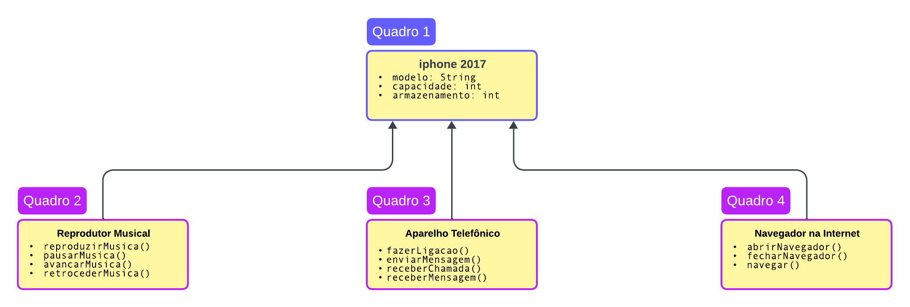

## Diagrama de classes

Diagrama de classes UML para representar os papéis do iPhone 2017, que incluem Reprodutor Musical, Aparelho Telefônico e Navegador na Internet. Em seguida, vou criar as classes e interfaces em formato Java.

## Agora, criaremos as classes e interfaces em Java:

-iPhone2017.java
-ReprodutorMusical.java
-AparelhoTelefonico.java
-NavegadorInternet.java

Aqui estão as classes e interfaces Java que representam os papéis do iPhone 2017 como Reprodutor Musical, Aparelho Telefônico e Navegador na Internet.

